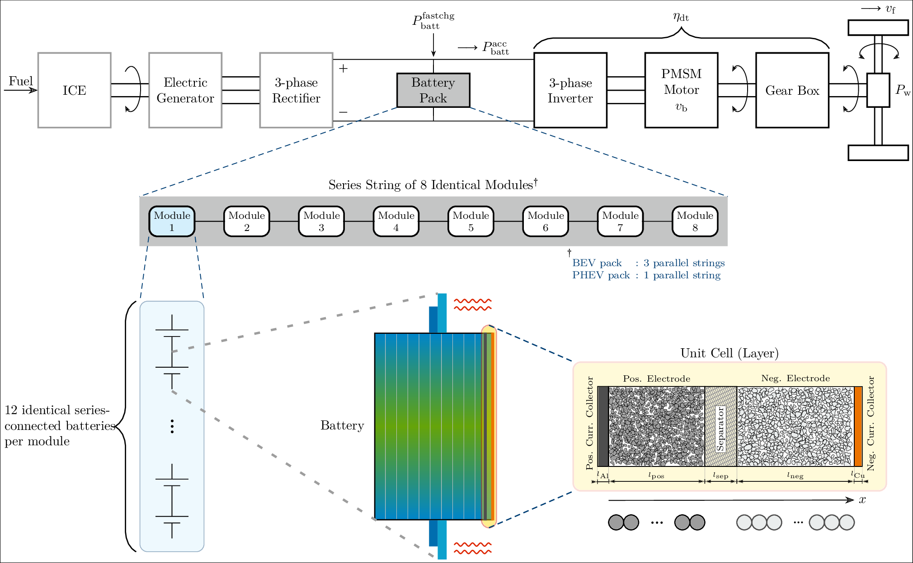

##  PhD thesis (LaTeX source files) of Krishnakumar Gopalakrishnan

### Architecture

### Abstract

The realisation of Physics-Based Models (PBMs) of lithium ion cells in the
Battery Management Systems (BMSs) of electric vehicles is studied through a
three-pronged strategy -- analysis, design and implementation. The survey of
literature undertaken in the backdrop of this broad landscape reveals a dearth
of model-based designs for automotive-grade pouch cells, which is therefore
addressed in this work. Perusal of prior art in reduced-order battery modelling
provides key guidance on topics meriting further investigation viz. the
Discrete-Time Realisation Algorithm (DRA) scheme and the electrolyte-enhanced
Single Particle Model (SPM) which are therefore carefully analysed here from the
perspective of their embedded implementation. Owing to its familiarity and
wide-spread popularity among relevant stakeholders, the Pseudo Two-Dimensional
(P2D) implementation of the Doyle-Fuller-Newman (DFN) model is used as the PBM
underpinning all research presented herein.

A computational framework to optimise the number of electrochemical layers
within a pouch cell is developed. The chosen optimality criterion specifically
addresses the two most pertinent issues that currently hinder the mass-market
adoption of electric vehicles -- range anxiety and fast charging. Driven by the
need for a balanced capacity loading at both electrodes, a deterministic
criterion for computation of electrode thicknesses is formulated. The search
space of layer choices across all thermal scenarios is traversed with the least
operation count through a novel application of the binary search algorithm.
Numerical simulations of a lumped thermal model coupled with the P2D
electrochemical model in conjunction with judiciously chosen exit conditions
help to inform the number of layers needed to maximise the cell's usable
capacity whilst simultaneously satisfying the power requirements of fast
charging. The P2D model is reformulated to accord it with the innate ability to
accept power inputs. The model-led optimal layer design procedure thus developed
is plating-aware, facilitating the extension of pack lifetimes whilst helping to
bypass expensive empirical prototyping.

Owing to its simplicity, the SPM family of models is deemed to be the most
promising Reduced Order Model (ROM) candidate that can usher in the use of PBMs
in electric vehicles. An in-depth analysis of the SPM reveals an inherent
mismatch between the accuracies of its voltage and State of Charge (SOC)
predictions, thereby rendering it unsuitable as the plant model in
state-estimation tasks. A comprehensive evaluation of the salient
electrolyte-enhanced SPMs from literature reveals that most solutions are either
mathematically intractable or overly simplistic. For the ionic concentration in
the electrolyte, analysis of the quadratic approximation model, which straddles
the boundary between computational complexity and mathematical tractability,
reveals a poor temporal performance particularly at the current collector
interfaces. However, it is capable of delivering acceptable levels of accuracy
in computing the spatial profile of ionic concentration. Application of the
Multi-Gene Genetic Programming (MGGP) technique exposes that the causal factor
for this mediocre temporal performance is the equation deficiency of the
underlying P2D model.

From an implementation perspective, the discrete-time formulation of SPMs is
presented by using the matrix exponential approach and its advantages over its
continuous-time counterparts enumerated. Despite its inherent shortcomings, it
is deemed that operating within the confines of the well-established foundations
of the P2D dynamics represents a definitive step forward in bringing into
fruition the goal of incorporating PBMs into vehicular BMSs. Therefore, the
existing quadratic approximation model is retained for the electrolyte spatial
concentration, whilst advocating the novel application of a system
identification method for its temporal dynamics. After establishing linearity
and time-invariance of the subsystems under consideration, discrete-time
transfer functions of the number of moles per unit area of lithium ions in each
electrode region is identified for the pertinent range of applied currents. The
identified transfer functions are then employed in a composite SPM which
demonstrates superior accuracy compared to the incumbent state of the art
electrolyte- enhanced SPM, thereby demonstrating a substantial accomplishment
from an implementation viewpoint. Although the advancements herein are reported
for an isothermal implementation of the models, future enhancement through
thermally coupled model derivations is advocated. Finally, the importance of
parametrisation of the underlying PBM is acknowledged as a crucial unsolved
aspect which needs the collective effort of the battery research community.

